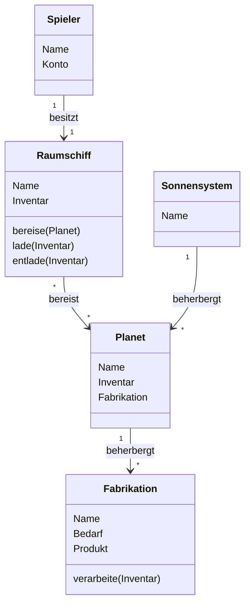

# Space Realm
Space Realm ist ein Browser-basiertes Wirtschafts- und Strategiespiel. Der Spieler steuert ein Raumschiff, welches sich auf Grid-basierten Karten der Galaxis bewegt. Ziel des Spiels ist es, produktive Wirtschaftsstandorte zu finden, entwickeln, und an ein Netz seinergleichen anzubinden. Dadurch sollen profitable Produktionsketten entstehen. Diese müssen sowohl zufällig auftretenden Naturereignissen standhalten, als auch mit den Unternehmen anderer Spieler konkurrieren können.

## Vision - Ziele des Spiels
Bei der Entwicklung des Spiels wird an jedes Feature der Ansprcuh gestellt, auf mindestens eines der folgenden drei Ziele einzuzahlen, um schlussendlich die Vision des Spiels weiter zu treiben und zu vervollständigen:
* **Minimalinvasives Spiel:**
Der Spieler soll durch Space Realm möglichst wenig im Ablauf seines Tages gestört werden. Der Spieler soll explizit nicht einen längeren Zeitraum blockiert oder abgelenkt werden. Stattdessen soll sich Space Realm perfekt dafür eignen, um mehrmals am Tag für einige wenige Minuten positiv abzulenken.
* **Dynamische Welt:**
Die Welt von Space Realm soll auf einem soliden Fundament von Metriken und Funktionen stehen, welches die Standorte und Unternehmen miteinander verbindet. Diese Verbindung soll sich vor allem dadurch manifestieren, dass Handlungen der Spieler den Zustand der Galaxien verändern.
* **Skalierung und Erweiterbarkeit:**
Space Realm startet als 1-Mann-Projekt ohne Budget. Dementsprechend werden erste Alpha-Versionen und Demos auf einem technisch sehr trivialen Stand entstehen müssen. Trotzdem soll die Architektur, sowie auch das Game-Design jederzeit eine nahezu unbegrenzte Skalierung ermöglichen und anderen Raum bieten, sich kreativ in das Proejkt miteinzubringen.

## Technologien
Im Laufe der Entwicklung kann und wird sich ein eingesetzt Technologie Stack zwangsläufig immer verbreitern und verändern. Trotzdem stecken im Kern ein paar wenige Grundsatz-Entscheidungen, die Bestand haben. Diese sind für Space Realm wiefolgt abgesteckt:
* **Frontend:**
Auf das erste Ziel der Vision einzuzahlen wird das Frontend und damit die Benutzeroberfläche von Space Realm als responsive Web Applikation umgesetzt. Damit steht sie auf jedem beliebigen Rechner, Tablet, oder Smartphone zur Verfügung. Weiter wird dem Frontend eine funktionale Programmiersprache zu Grunde gelegt, um hohe Qualität zu gewährleisten und der asynchronen Natur einer Web Applikation Rechnung zu tragen.
* **Persistenz:**
Zustand in Space Realm wird über Ereignisse permutiert, die durch zeitgesteuerte Trigger der Spielwelt (sogenannte Game Ticks), oder Spieler Interaktion ausgelöst werden. Um diese möglichst intuitiv persistent zu halten, wird eine persistente Queue eingesetzt. Diese ermöglicht neben der Skalierung auch eine gute Nachvollziehbarkeit, sowie flexible Erweiterbarkeit durch neue oder verbesserte Ereignis Formate.
* **Backend:**
Die Abbildung der Spiellogik, sowie die Verbindung zwsichen der Persistenz und dem Frontend obliegt dem Backend. Hier finden alle Operationen statt, die aufgrund der Anforderungen an die Vertrauenswürdigkeit nicht direkt im Backend umgesetzt werden können. Daz ugehören neben der Benutzerverwaltung alle Permutationen des Spielzustandes. Die hier eingesetzt Sprache muss die funktionalen Aspekte unterstützen, um auf Ereignissen zu arbeiten, mit eventual onsistency zurecht zu kommen, und mit hoher Qualität und absoluter Präzesion die Spiellogik durchzuführen.

## Minimal Viable Product
Der erste Meilenstein der Roadmap für Space Realm ist voraussichtlich der wichtigste. Es handelt sich hierbei um das Minimal Viable Product (im Folgenden MVP genannt), also um eine Version des Spiels, welche die Vision transportiert und damit Interesse und Neugier weckt. Das Feature Set hierfür ist sehr stark begrenzt, um den meilenstein möglichst früh zu erreichen und potentielle Mitentwickler in das Projekt zu integrieren. Es folgt eine genaue Beschreibung der Entitäten, die für das MVP imlementiert werden, sowie deren Beziehungen und Interaktionsmöglichkeiten für den Spieler.

### Spieler
Die Entität Spieler steht stellvertretend für einen Spieler in Space Realm. Neben dem Alias des Spielers enthält sie dessen Kontostand. Ein Spieler steuert im Rahmen des MVP genau ein Raumschiff, perspektivisch jedoch viele mehr.
### Raumschiff
Das Raumschiff ist zunächst die physische Manifestation des Spielers in der Welt von Space Realm. Es ermöglicht diesem verschieden Planteen zu bereisen und dort Inventar zu ent- oder beladen.
### Sonnensystem
In einer Sonnensystem Entität befindet sich eine beliebige Menge an Planeten und Raumschiffen. Der MVP erstreckt sich über ein einziges Sonnensystem, perspektivisch jedoch kann es beliebig viele geben. 
### Planet
Die Planeten stellen in Space Realm die Lokationen dar, zwischen denen sich Raumschiffe innerhalb einer Karte bewegen können. Jeder Plante kann eine beliebige Anzahl an Fabrikationen beherbergen, die sich von dessen Inventar bedienen.
### Fabrikation
Die Fabrikationen eines Planten stehen für dessen Industrie und Landwirtschaft. Sie bestimmen, welche Güter der Planet verarbeiten kann und welche Produkte daraus erzeugt werden können.
